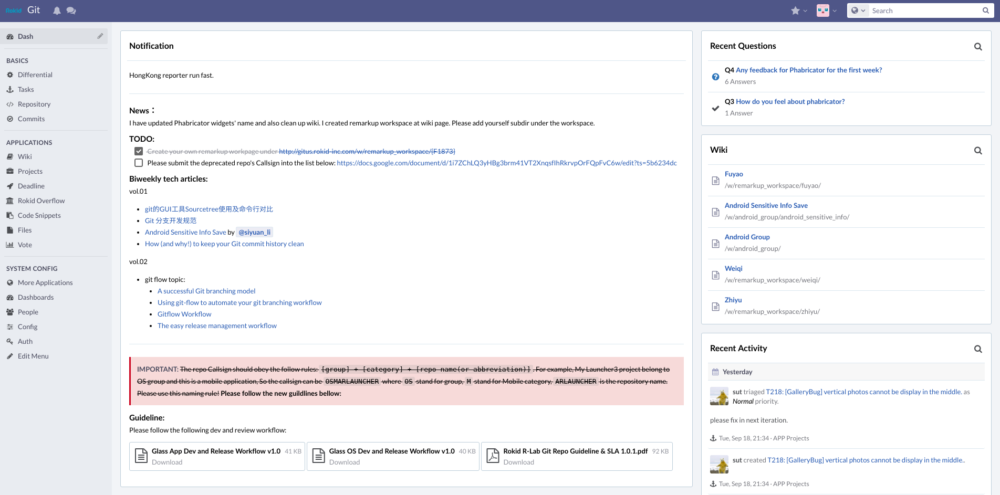

@snap[north-west]
<br><br><br>
<h2>@color[orange](Personal Performence Review)<h2>
@snapend

@snap[west]
<br><br><br><br>
Dingyi Chen
@snapend

---

@snap[north-west]
<br><br>
<h4>@color[orange](Involved Poejects)<h4>
@snapend

@snap[west span-100]
<br><br>
@ol[](false)
- Phabricator:<br>@size[0.5em](Setting Phabricator up and run by using docker, as well as introducing development specifaction from git workflow.)

- Launcher:<br>@size[0.5em](Implementing Rokid Glass Laucher systemn UI and refactoring into native launcher3 APP.)

- System UI:<br>@size[0.5em](Starting the development of systemn UI, such as <i>Dialog<i>, <i>Notification<i>, etc. )
@olend
@snapend
  
---

### @color[orange](Phabricator: Status)

@fa[check-square-o fa-1x] Closed

@fa[square-o fa-1x] Under Long Term Maintaince

---

### @color[orange](Phabricator: Comments)

@fa[thumbs-up fa-1x] Robust Git Ecos

@fa[thumbs-up fa-1x] Review Panel

@fa[thumbs-o-down fa-1x] Manually Backup

@fa[thumbs-o-down fa-1x] Documents to be perfected

---

### @color[orange](Phabricator: Impact)

@fa[users fa-1x] Used by All Engineers in Rokid, Inc. Every Day.

---

### @color[orange](Launcher: Status)

@fa[check-square-o fa-1x] Phase #1 Based on Old UI

@fa[square-o fa-1x] Adapt to New UI

@fa[square-o fa-1x] Product Fuctions

---

### @color[orange](Launcher: Comments)

@fa[thumbs-up fa-1x] Less Compatible Problems

@fa[thumbs-up fa-1x] Bug-free on Runtime

@fa[thumbs-up fa-1x] Low Energy Consumption

@fa[thumbs-o-down fa-1x] Hard to Implement New Features

---

### @color[orange](Launcher: Impact)

@fa[users fa-1x] **[FUTURE]** Home APP for all developers and testers, also the most basic APP for Users.

---

### @color[orange](System UI: Status)

@fa[check-square-o fa-1x] Achieve APP Level UI Fuction

@fa[square-o fa-1x] Merge Into Frameworks

@fa[square-o fa-1x] Find out All Scenes

---

### @color[orange](System UI: Comments)

@fa[thumbs-o-down fa-1x] Framework Development Issue

---

### @color[orange](System UI: Impact)

@fa[users fa-1x] **[FUTURE]** Handle All the Dialogs and Notifications Raised Up by Android System, Including NONO's Bluetooth Connection Pop-up Issue

---

## @color[orange](Outcome Display @fa[hand-o-right fa-8x fa-orange])

---

### [Phabricator](http://gitus.rokid-inc.com/)


---

### @color[orange](Git Flow)


---

@snap[north-west]
<br><br>
<h3>@color[orange](System UI Developing Pattern)<h3>
@snapend

@snap[west span-100]
<br>
@ol[roman](false)
- Riview Design UI
- Locate Source Code
- Add or Modify API
- Change Layout and Logic
- Release for testing
@olend
<br><br>
@snapend

---

### @color[orange](Dialog UI)


---

### @color[orange](Future Work: System UI)

- Notification	
- Dialog ...

---

### @color[orange](Future Work: System Apps)

- Launcher	
- Settings	
  - Bluetooth	
  - Wifi 	
  - cast ...	

---

### @color[orange](Future Work: DevOps)

- CI system	
- Slack Integration	

---

## @color[orange](Self Review @fa[stethoscope fa-8x fa-orange])

---

### @color[orange](Case Study)

```
int childLeft = offsetX;
if (mPageScrolls == null || childCount != mChildCountOnLastLayout) {
    mPageScrolls = new int[childCount];
}

for (int i = startIndex; i != endIndex; i += delta) {
    final View child = getPageAt(i);
    if (child.getVisibility() != View.GONE) {
        lp = (LayoutParams) child.getLayoutParams();
        int childTop;
        if (lp.isFullScreenPage) {
            childTop = offsetY;
        } else {
            childTop = offsetY + getPaddingTop() + mInsets.top;
            childTop += (getViewportHeight() - mInsets.top - mInsets.bottom - verticalPadding - child.getMeasuredHeight()) / 2;
        }

        final int childWidth = child.getMeasuredWidth();
        final int childHeight = child.getMeasuredHeight();
        childTop = offsetY + getViewportHeight() - child
        if (DEBUG) Log.d(TAG, "\tlayout-child" + i + ": " + childLeft + ", " + childTop);
        child.layout(childLeft, childTop,
                childLeft + child.getMeasuredWidth(), childTop + childHeight);

        mPageScrolls[i] = childLeft - getViewportWidth() / 2 + childWidth / 2 - offsetX;
```

@[1](Move all apps to middle of the screen)

@[25](Move all apps to middle of the screen)

---

### @color[orange](Case Study)

``` java
@Override
    public void setInsets(Rect insets) {
        mInsets.set(insets);
        mInsets.set(new Rect(700, 150, 700, 150));

        CellLayout customScreen = getScreenWithId(CUSTOM_CONTENT_SCREEN_ID);
        if (customScreen != null) {
            View customContent = customScreen.getShortcutsAndWidgets().getChildAt(0);
            if (customContent instanceof Insettable) {
                ((Insettable) customContent).setInsets(mInsets);
            }
        }
```
@[4](Clip the child View inside of parent View)

---

### @color[orange](Aspects to be Improved @fa[line-chart fa-6x fa-orange])

- More Peer or Team Project with Other Engineer

- Personal Time Management

---

@snap[west span-65]
@fa[linux fa-huge]

@snapend

@snap[north-east span-30]
<br><br><br>
@quote[Android的功夫，在Android之外。](知乎答主)

@snapend

---
@transition[slide-in]

## @color[orange](@fa[android fa-1x fa-spin fa-lime] Thank you @fa[android fa-1x fa-spin fa-lime])

#### Q & A

